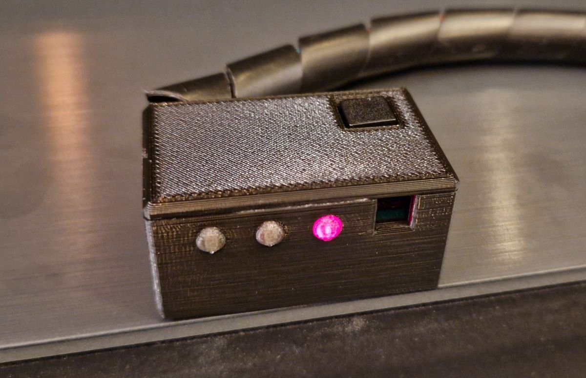

# James II: Your Butler brought to the next level.
The Idea behind JamesII Butler is to implement smart home features in combination with multimedia, networking and interactive applications to your existing infrastructure. It consists of distributed python nodes which connect via a RabbitMQ server to talk to each other. There is one core node which hosts the configuration and some basic features.
The system is also very handy in combination with RaspberryPi's ([www.raspberrypi.org/](http://www.raspberrypi.org/)).

## Things / Services you can use or interact with:
* CLI (managed) interface with history and command completion
* Cron (autoload on core node) which emulates a standard Unix like cron daemon
* Dbus-Notify (manual) as a messaging front-end
* Espeak (managed) as a messaging front-end and some commands
* Jabber (managed) as a messaging front-end and interface (has also MUC support)
* Monitor (managed) to show what is going on in the console
* Motion (managed) to watch over your home and also to automatically start web-radio when you get up on weekends
* Mpd-Client (managed) to start/stop internet radios on different occasions (can also fade in and out for gn8, wakeup or
noise)
* BTPresence (managed) to scan the area for known bluetooth mac addresses
* Raspberry (managed) interactive interface with buttons/switches and LEDs to interact with the real world
* RGB-LED (managed) to control RGB LEDs trough a arduino connected with i2c to JamesII
* Sysstat (autoload) to request information's about the host like mounts, net info, memory info, ...
* System (autoload) james system calls mostly used internally
* Timer (autoload on core node) the all mighty MCP to time commands with "in" and "at"
* Transmission (managed) to add/remove/start/stop torrent downloads on a transmission server
* Wakeonlan (managed) to wake up devices when you come home for example
* Kodi (managed) to trigger database updates and display onscreen messages
* Evdev (managed) to be controlled by IR devices (you have to configure your evdev things yourself!)
* Voice-Commands (managed) to control James via voice! Just like LCARS (if you add some fantasy ;) )... Yes, this is way older than Alexa, Siri or Google Assistant
* MQTT (managed) to integrate with MQTT-based systems like Node-RED and Home Assistant. Publishes state (presence, nodes, alarmclock, cron/timer, radio stations) and accepts commands via MQTT topics
* Google Calendar (managed) to integrate with Google Calendar for presence detection and alarm clock control. Save your [`client_secret.json`](https://developers.google.com/calendar/api/quickstart/python) to `~/.james2_google_client_secret.json`
* CalDAV Calendar (managed) to integrate with CalDAV servers (tested with Nextcloud calendar) for presence detection and alarm clock control

### Python 3
JamesII is mostly ported to python 3. The core things are working great, but there might be errors found in the future. The most errors had to do with UTF-8, encoding and decoding things. The following plugins where not tested with python 3 since I don't use them (anymore?):

* Dbus-Notify
* HTTP Server
* Monitor
* Motion
* Voice-Commands
* Wakeonlan

#### Plugin modes explanation:
* Manual: Passive plugins are run exclusively, normally with a separate bash command
* Managed: Only loaded if specified in config
* Autoload: If all requirements are met, this plugin will be loaded automatically

### Core functionality:
* Integrated help. Just type help in interfaces
* Command aliases like "in 10m nom" which in fact will do "mcp in 10m espeak say nom nom nom nom nom"
* Logger facility with network functionality who also can log to mysql (netlogger.py)
* @hostname1,hostname2 for running commands only on chosen host(s)
* && to split commands (will not wait for the first command to exit, will send them right after each other)

### Not yet done:
* HTTP Server (managed) (As front-end, console and also RESTful API for mobile clients)
* YAML Schema to detect wrong config files
* Doorbell extension for RaspberryPi Plugin
* Plugin requirement checks before load for external files
* Monitor LAN for unknown MAC addresses, MAC address db (see old james)

## You Need:
* python3
* Ideally a venv to install all the requirements in `requirements.txt`
* Some plugins require additional python libraries and have their own `requirements-*.txt`. Those got excluded from the main `requirements.txt` file since they are mostly only used seldom or are not very Raspberry Pi friendly.

### Optional (Plugin specific):
#### Raspbian packages (`apt install XXX`)
* espeak (espeak plugin)
* motion (motion plugin)

#### pip packages (`pip install XXX`)
* lgpio (raspberrypi plugin, pip install)

#### Notes on some plugins
#### mpd noise
The noise command plays a file from the mpd library in an endless loop (or until i.e. a wakeup command is sent).
This file needs to be added to the library manually! I downloaded mine from
[www.audiocheck.net/testtones_pinknoise.php](https://www.audiocheck.net/testtones_pinknoise.php)

##### mpd and espeak
If the mpd and espeak plugins are used together, ensure to use the "software" mixer for mpd, or the
mpd plugin will also regulate the volume of espeak.
Example `/etc/mpd.conf`:
```
audio_output {
        type            "alsa"
        name            "My ALSA Device"
        mixer_type      "software"      # optional
        mixer_device    "default"       # optional
}
```

##### evdev
If you use a DIY IR receiver, you have to configure `/boot/config.txt` on Raspberry Pis
something like this:
```
[all]
dtoverlay=gpio-ir,gpio_pin=25
# dtoverlay=gpio-ir-tx,gpio_pin=4
```
There was a time, when JamesII supported sending IR codes as well. Since the migration from lircd to evdev,
this functionality has been removed. Please create a issue or wait for an undefined time for this feature to
be reimplemented. :)

#### Debian/Ubuntu:
	apt-get install bluetooth espeak motion

## Installation:
* Clone JamesII to a directory as user "youruser"

	git clone git://github.com/oxivanisher/JamesII.git

* Install base requirements (ideally in a virtual environment)

	cd JamesII
	python3 -m venv venv
	source venv/bin/activate  # On Windows: venv\Scripts\activate
	pip install -r requirements.txt

* Edit your main config file only on master node ([config/config.yaml.example](https://github.com/oxivanisher/JamesII/blob/master/config/config.yaml.example "Base Config Example"))
* Edit your broker config file on every node ([config/broker.yaml.example](https://github.com/oxivanisher/JamesII/blob/master/config/broker.yaml.example "Broker Example"))

## RabbitMQ Server Setup:
You only need one server per network. This server does not need a JamesII node.
* Install RabbitMQ as root (Debian/Ubuntu):
	apt-get install rabbitmq-server
* Then you have to configure your rabbitmq server as root and choose a password for the broker.yaml config:

	<pre>rabbitmqctl add_user james2 password
	rabbitmqctl add_vhost james2
	rabbitmqctl set_permissions -p james2 james2 ".*" ".*" ".*"</pre>

### Autostart on Linux:
* Starting it with the james2_autostart_loop.sh script as a user with sudo rights in a screen. Dirty, i know! But some plugins need root access to fully work. Here is how to give the user the needed rights via "visudo" as root:

	youruser ALL=(ALL) NOPASSWD: ALL
* To start JamesII automatically with your system, add the following line to /etc/rc.local before the "exit 0" line:

	su -c /path/to/JamesII/james2_autostart_loop.sh youruser &

### How to integrate JamesII to your infrastructure:
#### Desktop torrent download:
	$ sudo vim /usr/share/applications/JamesII.desktop

	[Desktop Entry]
	Exec=/path/to/JamesII/src/cli.sh tr add %U
	MimeType=application/x-bittorrent;x-scheme-handler/magnet;
	Terminal=false
	Type=Application

	$ xdg-mime default JamesII.desktop x-scheme-handler/magnet

#### Desktop DBUS Notifications:
	start the dbus-notify_loop.sh with your desktop

#### Motion Plugin:
After setting up motion, add the following lines to your /etc/motion/motion.conf:

	on_picture_save "/path/to/JamesII/src/cli.sh motion img %f"
	on_movie_end "/path/to/JamesII/src/cli.sh motion mov %f"
	on_camera_lost "/path/to/JamesII/src/cli.sh motion cam_lost"

#### RaspberryPi Plugin:
The system uses the GPIO numbers. Please be aware, that there are three (!) pin numbering schemes.
To reduce confusion, here are some resources which help translate and explain the different schemes:

* [Interactive Raspberry Pi pinout](https://pinout.xyz/pinout/)
* [Lgpio homepage](https://abyz.me.uk/lg/py_lgpio.html)

See the `electronics/rasp_plugin_circuits` folder for circuit examples created with
[www.circuit-diagram.org](https://www.circuit-diagram.org/).

##### External module
For the external module to control JamesII with a infrared remote and one button as well as see events
/ states through LEDs, see the `electronics/rasp_plugin_circuits/rasp_ext_module*` folder and find the 3D
printed case for it on [printables.com](https://www.printables.com/model/582717-jamesii-external-rasp-plugin-case).

I chose the pins for this module to work together with a Hifiberry audio module so I did intentionally not use th GPIOs 2, 3, 16, 18, 19, 20 and 21.

This table explains the different pin naming schemas and how to connect the external module with the example JamesII config:

| James CFG / GPIO | WiringPi | Header pin number | Comment        |
|------------------|----------|-------------------|----------------|
|                  |          | 1                 | +3V            |
|                  |          | 2                 | +5V            |
|                  |          | 6                 | GND            |
| 17               | 0        | 11                | LED 1 (green)  |
| 27               | 2        | 13                | LED 2 (yellow) |
| 22               | 3        | 15                | LED 3 (red)    |
| 23               | 4        | 16                | Button         |
| 25               | 6        | 22                | Infrared rcv   |



#### RGB-LED Plugin:

This plugin uses a arduino connected via i2c to control a WS2812B RGB LED strip. This allows i.e. to use JamesII as a rainbow light alarm clock. Check the `electronics/arduino` folder for little more information.

## Technologies and software used (incomplete!):
* XMPP http://en.wikipedia.org/wiki/Extensible_Messaging_and_Presence_Protocol
* AMQP http://en.wikipedia.org/wiki/AMQP
* MQTT https://mqtt.org/
* Motion http://www.lavrsen.dk/foswiki/bin/view/Motion/WebHome
* eSpeak http://espeak.sourceforge.net/
* MPD https://www.musicpd.org/
* Transmission http://www.transmissionbt.com/
* Kodi Media center https://kodi.wiki/
* Raspberry Pi http://www.raspberrypi.org/

## Thanks go to:
* http://github.com/westlicht for a lot of OO and Python knowledge
* http://aron.ws/projects/lirc_rpi/ for the IR solution used with RaspberryPi
* Kurt Fierz and Anaxagoras for support with the electronics part of JamesII (RaspberryPi plugin)
